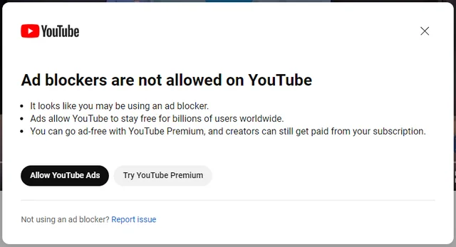

# YouTube Hide Blocker Popup Chrome Extension

The Chrome extension **YouTube Hide Blocker Popup** is a simple but practical tool that helps you <u>hide pop-up</u> blockers on YouTube and <u>restart the video</u>.

  
  
  

## 💾 Installation Guide

Download the latest release in the [releases section](https://github.com/LouisLanganay/youtube-hide-blocker-popup/releases) or clone the repo.

Steps to install the extension:
- Go to chrome extensions tab (open chrome://extensions/)
- Enable developer mode (top right corner)
- Unzip the extension folder
- Click on "Load unpacked" and select the unzipped folder of the extension

## 📝 Contributing

If you would like to contribute to the development of this extension or report issues, please open an issue on the GitHub repository or create a pull request.

If you have any questions or encounter issues with the extension, feel free to contact us via the GitHub repository.

> [!WARNING]
> Popup blocker is a new feature from YouTube, so it may not work for all users. Youtube can change the way it works at any time, so the extension may not work anymore. If you encounter any issues, please open an issue on the GitHub repository.
